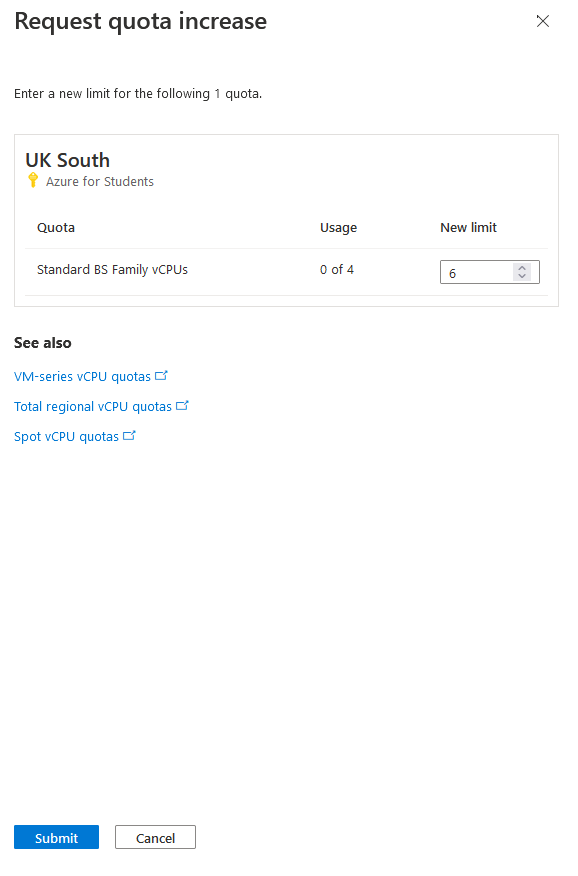

# Errores Encontrados

## Errores Terraform

En terraform se me ha quejado por distintos motivos

### Contraseña no suficientemente fuerte

Error:

``` terraform
  admin_password                  = "password"
```

Solucion:

``` terraform
  admin_password                  = "P@assword01"
```

### Discos virtuales

Al ponerle el mismo nombre se me ha quejado de que dicho recurso ya existia
Al cambiar el nombre de cada disco y ponerle un nombre mas descriptivo a cada disco.

### Limite de vCPU

Habia un problema por el limite de CPU que debia usar.



Al cambiar el tipo de sizes ya se ha solventado


### Marketplace image requires Plan information

En un momento dado me devolvia estoy en la consola al hacer `terraform plan`: 

``` PowerShell
  Code="VMMarketplaceInvalidInput" 
  Message="Creating a virtual machine from Marketplace image or a custom image sourced from a Marketplace image requires Plan information in the request. 
  VM: '/subscriptions/2e40fdd6-52a1-4e7e-9f69-71600c6f7d90/resourceGroups/casoPractico2/providers/Microsoft.Compute/virtualMachines/kubeMaster'."
│
│   with azurerm_linux_virtual_machine.kubernetesMaster,
│   on recursos.tf line 81, in resource "azurerm_linux_virtual_machine" "kubernetesMaster":
│   81: resource "azurerm_linux_virtual_machine" "kubernetesMaster" {
│
╵
```

En este caso me he olvidado de escribir el plan en cada `azurerm_linux_virtual_machine`:

``` terraform
  plan {
    name      = "centos-8-stream-free"
    product   = "centos-8-stream-free"
    publisher = "cognosys"
  }
```